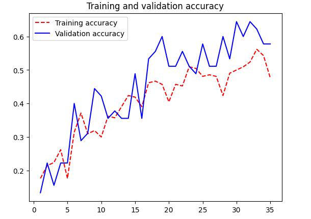
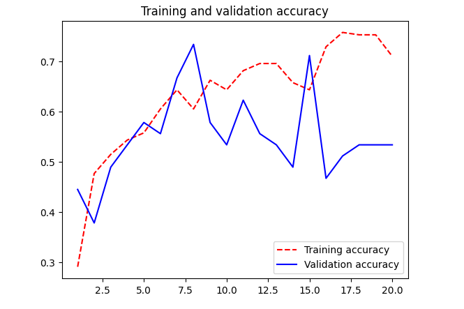
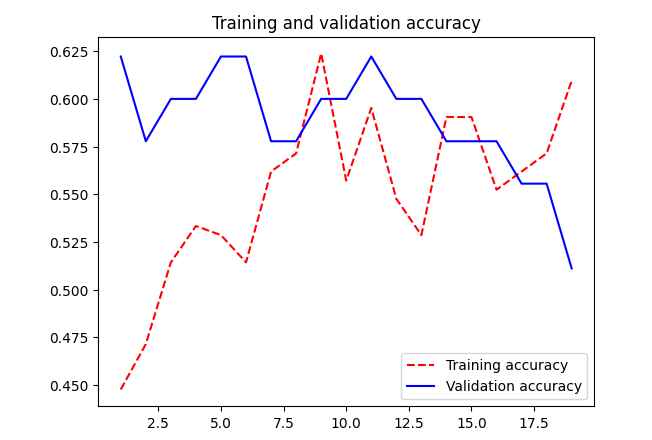

# Neural Network Project Assignment 2
The goal of this assignment was to train a neural network to classify images produced by our group.  
There are three models that were trained on the dataset:
- A simple CNN (Convolutional Neural Network) model trained from scratch.
- A MobileNet model pretrained on the ImageNet dataset.
- A fine-tuned MobileNet model, where the last few layers were retrained on our dataset.

The models are split into their own Jupyter notebooks.

## Dataset
The dataset consists of 300 images each depicting a human hand in various poses and angles.  
Each image has a white background and a pale hand, with 1-5 fingers extended.  
The dataset is split into classes based on the number of fingers extended, with 5 classes in total (1-5 fingers).  
The dataset was split into 70% training, 15% validation, and 15% testing sets.

## Learning Graphs
The following images visualize the learning graphs of each of the models.

  
### Learning graph of the CNN model. (Test accuracy 71.1%)
  
### Learning graph of the MobileNet model. (Test accuracy 60.0%)
  
### Learning graph of the fine-tuned MobileNet model. (Test accuracy 48.8%)

## Analysis
Pretrained models did not offer improvements over the baseline CNN model.  
This is most likely because of how limited the entire dataset is, with 300 images.  
The pretrained models were trained on over a million images, and probably attempt to  
learn minute details that may differ significantly from the images in our dataset.  
At the end of each notebook are examples of images classified by the models, both correctly and incorrectly.  
Analyzing these images did not provide any real insights into what the models were learning,  
 as mistakes were made on images that were very similar to correctly classified images.  
Considering the limited dataset, a result of 71.1% test accuracy for a best case run is acceptable.